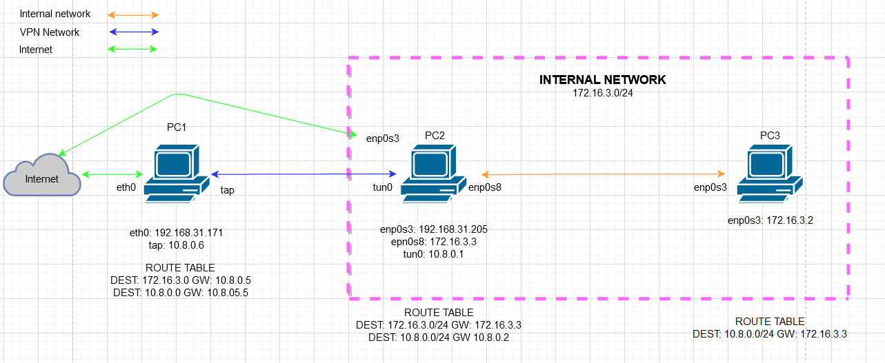

# This README file contains information about OpenVPN server.conf configruration, iptalbes rules and networking.

## Mentorship program content

* README.md - A set of useful information about a project.
* server.conf - A configuration file for the OpenVPN server.
* topology.png - An illustration of the implemented networking.

## Prerequisites

* 2 virtual machines ( One for our servers, another for connection testing )
* OpenVPN server
* CA server

WARNING! This repo doesn't include an information how to [install and configure OpenVPN and CA servers](https://www.digitalocean.com/community/tutorials/how-to-set-up-an-openvpn-server-on-ubuntu-18-04-ru). Your servers are supposed to be installed on the Ubuntu OS ( or any other debian based ditros ).

## Topology diagram



## OpenVPN server configuration

### Substitution of your default OpenVPN server configratuion

First you need to clone this repo:

```
git clone https://github.com/romanrzes/mentorship-program.git
```

Then change present working directory:

```
cd mentorship-program
```

Make a backup of your default `server.conf` file:

```
mv etc/openvpn/server.conf etc/openvpn/server.conf.backup
```

Copy a new `server.conf` to the openvpn directory:

```
cp server.conf etc/openvpn/server.conf
```

Last but not least - restart your OpenVPN server:

```
sudo systemctl restart openvpn@server
```

Congrats! Your OpenVPN server is loaded with new configuration.

## Iptables and network configuration

### Configuration on the OpenVPN server

For now our `iptables` doesn't know what should be accepted so it will reject our packets by default. There are two pretty similar rules. The only difference is source/destination adresses. In order to work correctly we should add `ACCEPT` rules for `INPUT` and `OUTPUT` chains.

```
sudo iptables -A PREROUTING -s 10.8.0.0/24 -d 172.16.3.0/24 -j ACCEPT
sudo iptables -A PREROUTING -s 172.16.3.0/24 -d 10.8.0.0/24 -j ACCEPT
```

### Configuration on the test machine

The only configuration this machine requires is adding a new route to the route table. Don't forget to change `enp0s3` to your network interface!

```
sudo ip route add 10.8.0.0/24 via 172.16.3.3 dev enp0s3
```

Now your test machine is configured to route packets from `10.8.0.0/24` to the OpenVPN server.
